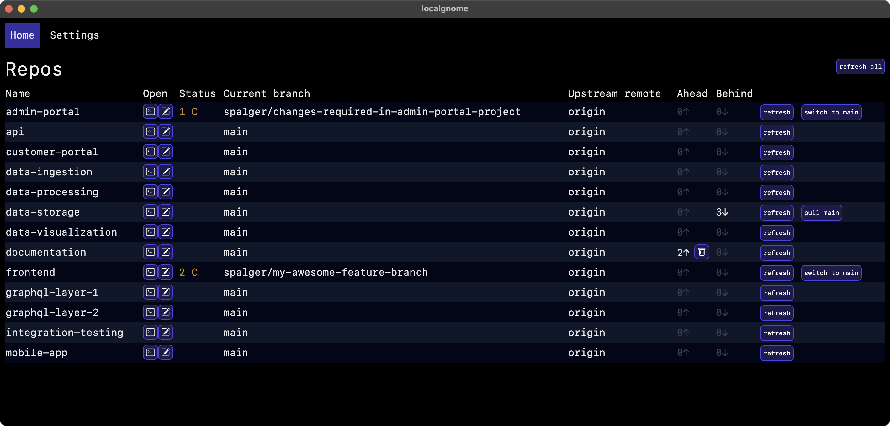

# localgnome

At work we have a large number of repositories that we checkout locally, and keeping track of which repo is behind, which is on main, and getting everything updated every couple of days is a process that I don't enjoy. In my spare time I built localgnome to help with this by providing a basic, and very ugly, UI that shows the high-level status of each repository in a given directory, and buttons for common actions like switching to the main branch, pulling the latest changes from upstream, etc.

